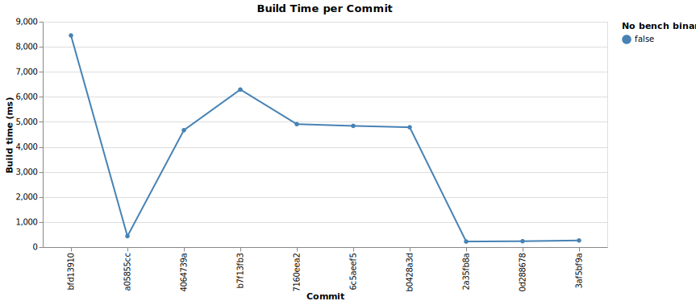
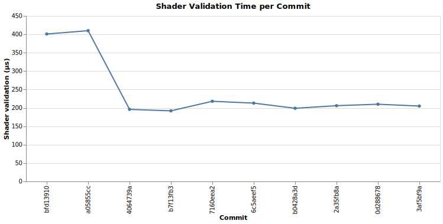
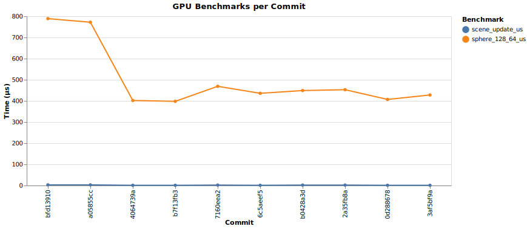

# Benchmark Range Report

Generated by `scripts/bench-report.py`.

## Summary

| label | build_ms | shader_validation_us | sphere_128_64_us | scene_update_us | subject |
| :--- | :--- | :--- | :--- | :--- | :--- |
| bfd13910 | 8452 | 401 | 789 | 3 | add SceneProperties uniform and egui controls |
| a05855cc | 435 | 410 | 772 | 3 | specify astronomore binary in just run |
| 4064739a | 4668 | 196 | 402 | 1 | add runtime sphere tessellation controls to egui |
| b7f13fb3 | 6292 | 192 | 398 | 1 | feat: add planetary textures and orbital models |
| 7160eea2 | 4910 | 218 | 469 | 2 | Add toggleable name overlays for all celestial bodies |
| 6c5aeef5 | 4840 | 213 | 436 | 1 | Translate all GUI strings from German to English |
| b0428a3d | 4785 | 199 | 449 | 2 | Fix name label alignment: render below projected body position |
| 2a35fb8a | 221 | 206 | 453 | 2 | Merge pull request #14 from AntonHermann/claude/celestial-name-overlays-fEV49 |
| 0d288678 | 234 | 210 | 407 | 1 | docs: update README and project plan to reflect current state (#13) |
| 3af5bf9a | 264 | 205 | 428 | 1 | Add historical benchmark range script and marimo report notebook |

## Charts

